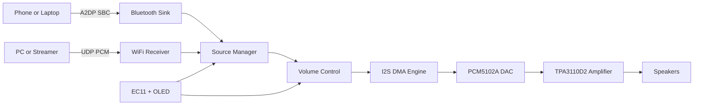

# SA32

<p align="center">
  
  
  
  
  
</p>

<p align="center">
  Smart audio firmware stack for a compact ESP32-S3 network + Bluetooth amplifier.
</p>

---

## Vision

SA32 is a practical hi-fi firmware platform focused on low-latency playback, clean signal flow, and hardware-first control.

It combines:
- ESP32-S3 real-time control and connectivity
- PCM5102A I2S DAC output
- TPA3110D2 class-D amplifier drive path
- Bluetooth A2DP sink and WiFi UDP receiver
- SSD1306 OLED UI and EC11 rotary input

## Why This Repo Exists

This repository is the control plane for building and iterating on a DIY network amplifier that can evolve from prototype to production-ready board support.

Design goals:
- Fast bring-up on real hardware
- Stable audio clocking and DMA path
- Source switching that is explicit and deterministic
- Debug visibility through serial CLI and heap diagnostics
- Modular code layout for codec and transport growth

## Architecture Snapshot



## Feature Board

| Area | Status | Notes |
| --- | --- | --- |
| Boot + board init | Ready | Mute-safe startup and peripheral init |
| I2S audio output | Ready | DMA-driven playback path |
| Bluetooth sink | Ready | A2DP SBC decode/playback |
| WiFi UDP stream | Ready | Raw PCM packet receiver |
| Persistent settings | Ready | NVS-backed config |
| Serial diagnostics | Ready | CLI and heap tooling |
| FLAC/Opus pipeline | Scaffolded | Hooks are present, full path pending |
| OTA updater | Planned | Partitions prepared |

## Repository Map

- smart_amp_proto: ESP-IDF firmware project root
- smart_amp_proto/main/audio: audio pipeline blocks (DMA, source manager, volume)
- smart_amp_proto/main/network: WiFi and Bluetooth transport
- smart_amp_proto/main/drivers: DAC, OLED, rotary, amp control drivers
- smart_amp_proto/main/codecs: codec integration and decoder wrappers
- smart_amp_proto/main/storage: NVS-backed config and persistence
- smart_amp_proto/main/utils: serial CLI and diagnostics

For full hardware pinout, toolchain setup, stream protocol, and CLI commands, open:
- [smart_amp_proto/README.md](smart_amp_proto/README.md)

## Quick Start

1. Install ESP-IDF v5.2.x on Windows.
2. Clone ESP-ADF and set ADF_PATH.
3. Build and flash firmware.

PowerShell example:

```powershell
cd c:\Users\tomas\Code\SokolAudio\smart_amp_proto
idf.py set-target esp32s3
idf.py build
idf.py -p COM5 flash monitor
```

## Fancy Bits You Can Add Next

If you want this README to look even more premium, add:
- Board photos and internal wiring shots in docs/media
- OLED UI screenshots and boot animation GIF
- Throughput and latency benchmark charts
- Audio pipeline timing diagram for each source mode

## Roadmap

- Finish FLAC/Opus decode path integration with ADF pipeline
- Add AVRCP command routing to source manager
- Implement OTA workflow and release channel strategy
- Add external digital input mode (I2S daughter board)
- Expand OLED from status view to full menu system

## Contributing

Contributions are welcome for transport robustness, codec integration, test harnesses, and board bring-up improvements.

Please open an issue with:
- target hardware
- expected behavior
- observed logs
- minimal reproduction steps

## License

Firmware in this project is BSD-3-Clause unless stated otherwise in component-level files.
